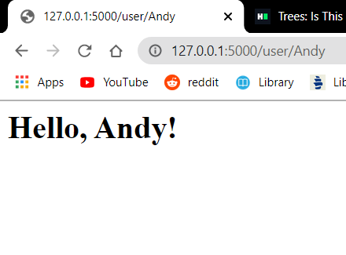

Andy L. Zhou
&nbsp;

this repo is a clone of https://github.com/miguelgrinberg/flasky

##Activity 1:

##Activity 2:

##Activity 3:
Flask contexts consist of the application context and the request context, 
both of which allows for objects to be accessed globally. 
These variables are current_app, g, requests, session. 
For example, we can get the name of a running app using the current_app variable, 
and we can get the headers of an HTTP request using requests. 
